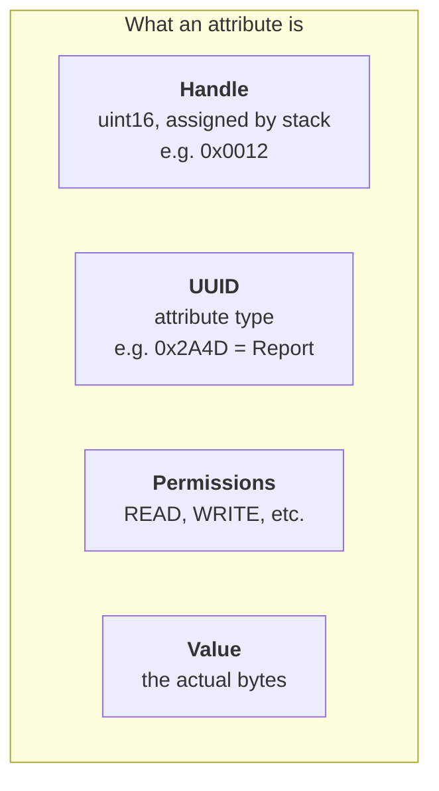
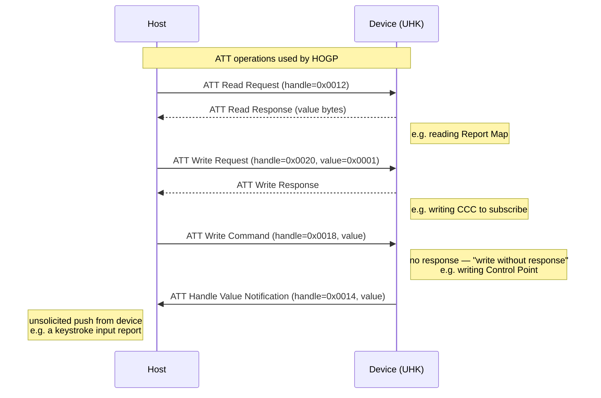
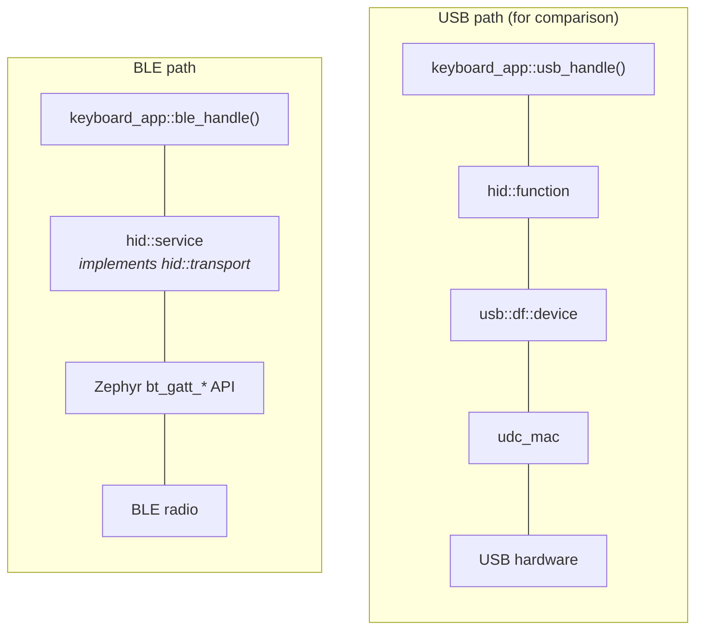
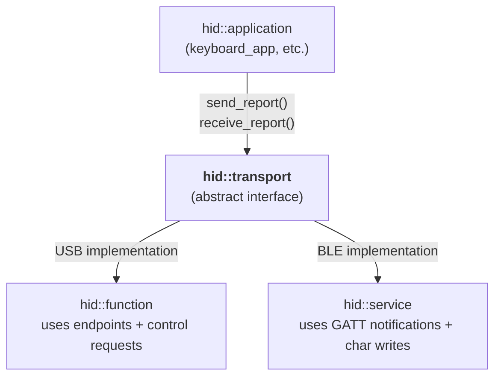
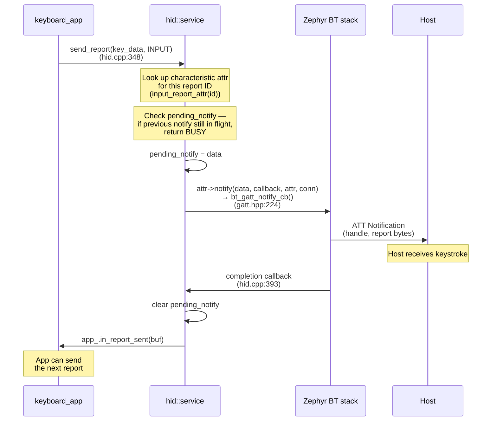
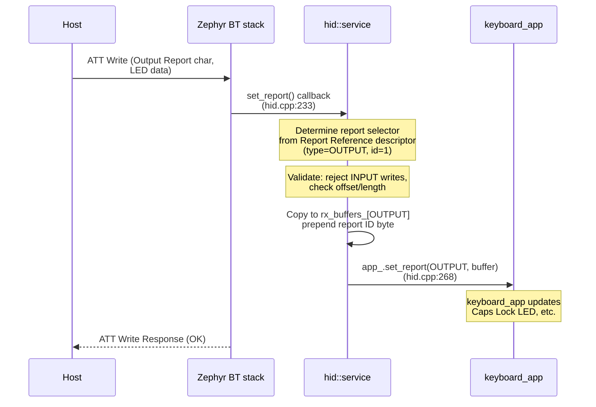
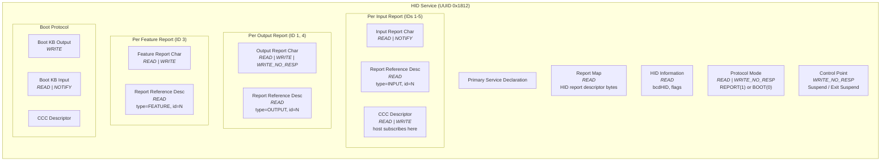
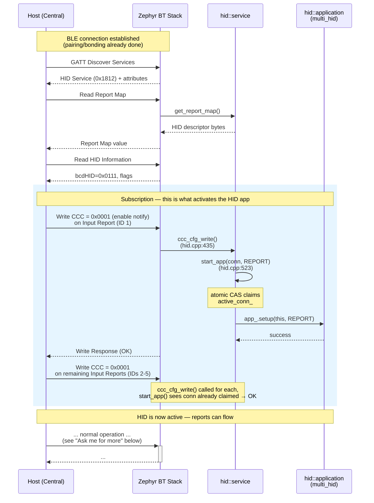
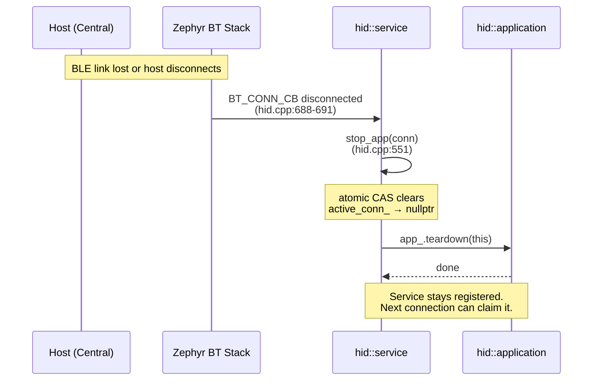
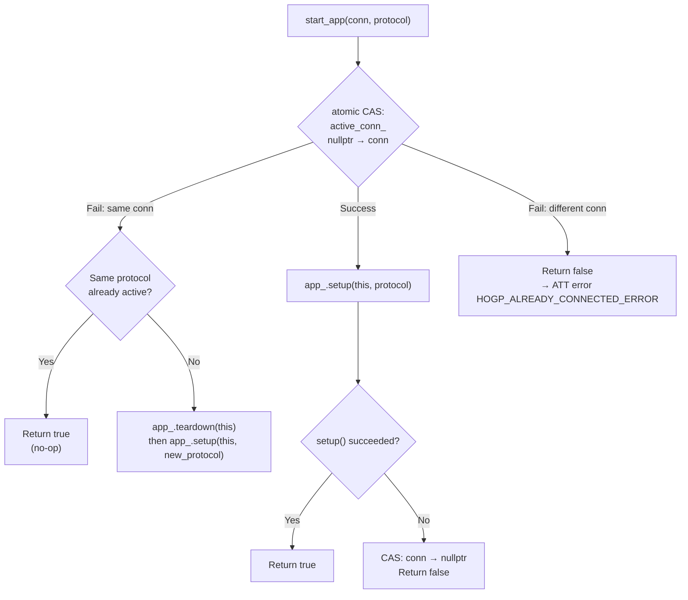

Yo# HOGP: c2usb ↔ Zephyr Integration

How the UHK's HID-over-GATT (HOGP) works, from BLE connection to keystrokes.

**Key source files:**

| Layer | File | Role |
|-------|------|------|
| GATT wrapper | `c2usb/port/zephyr/bluetooth/gatt.hpp` | Thin C++ wrapper over Zephyr's `bt_gatt_*` API |
| HID service | `c2usb/port/zephyr/bluetooth/hid.hpp` / `hid.cpp` | HOGP service implementation |
| Firmware glue | `device/src/usb/usb.cpp` | `hogp_manager`, `HOGP_Enable()` / `HOGP_Disable()` |

---

## GATT/ATT Crash Course

> If you're unfamiliar with GATT/ATT, read [gatt-primer.md](gatt-primer.md) first.

In short: the UHK is the GATT **server**, the host (laptop/phone) is the **client**. The client discovers services and characteristics by handle, then subscribes to notifications by writing to CCC descriptors. Notifications are how keystrokes reach the host.

### ATT (Attribute Protocol)

ATT is the wire protocol underneath GATT. Everything in the attribute table above — services, characteristics, descriptors — lives as a flat array of **attributes**, each with a numeric **handle** (assigned by the stack at registration time).

When the host talks to the device, every operation is an ATT request targeting a handle:

**Key differences between the ATT operations:**

| ATT operation | Direction | Response? | HOGP usage |
|---------------|-----------|-----------|------------|
| Read Request / Response | Host → Device | Yes | Report Map, HID Info, current report value |
| Write Request / Response | Host → Device | Yes | CCC subscription |
| Write Command | Host → Device | No | Protocol Mode set, Control Point, Output Reports |
| Notification | Device → Host | No | **Input Reports (keystrokes, mouse moves)** |

The important takeaway: **notifications are fire-and-forget from the BLE perspective**. The host never ACKs them at the ATT level. (The BLE link layer does ACK them, but that's invisible to GATT.) This is why `bt_gatt_notify_cb` has a *completion callback* rather than a *response callback* — it fires when the local stack has transmitted the packet, not when the host confirms receipt.

> [*Ask me for more*: MTU negotiation and how it affects max report size, security/encryption levels, ATT error codes]

---

## HOGP Layers (compared to USB)

On the USB side, c2usb has four layers: `function` → `device` → `mac` → `udc_mac` (see [c2usb-init.md](c2usb-init.md)). On the BLE side, the stack is **much flatter** — there's no `device`, no `mac`, no endpoint abstraction. `hid::service` talks directly to Zephyr's BT GATT API:

Why so much simpler? Because Zephyr's GATT layer already handles what `device` + `mac` do on the USB side — service registration, attribute dispatch, connection management. c2usb only needs a thin wrapper (`gatt::attribute`, `gatt::service`) around Zephyr's structs, and `hid::service` builds on top of that.

### What each layer does

| Layer | Class | Source | Role |
|-------|-------|--------|------|
| HID app | `keyboard_app`, `mouse_app`, ... | `device/src/usb/*.hpp` | Produces/consumes HID reports. **Same app classes as USB** — each has a `usb_handle()` and a `ble_handle()` returning separate instances. |
| HID transport | `hid::service` | `c2usb/.../bluetooth/hid.hpp/.cpp` | Implements the `hid::transport` interface. Builds the GATT attribute table, handles GATT callbacks, translates between `hid::application` calls and `bt_gatt_*` API calls. |
| GATT wrapper | `gatt::attribute`, `gatt::service` | `c2usb/.../bluetooth/gatt.hpp` | Thin C++ wrappers. `gatt::service` calls `bt_gatt_service_register/unregister`. `gatt::attribute::notify()` calls `bt_gatt_notify_cb`. |
| Zephyr BT | `bt_gatt_*` | Zephyr kernel | Manages connections, dispatches reads/writes to registered callbacks, sends notifications over the radio. |

### The shared interface: `hid::transport`

Both USB's `hid::function` and BLE's `hid::service` implement the same `hid::transport` interface. That's how the same `keyboard_app` works with both transports:

The app calls `send_report()` and doesn't care whether it goes over USB or BLE — the transport handles it.

---

## Report Flows

### TX: Keystroke → Host (notification)

Key details:
- Report ID byte is **stripped** before sending — GATT report characteristics don't include it (the Report Reference descriptor identifies which report it is). This is the `report_data_offset()` at `hid.hpp:175-179`.
- Only **one notification per report ID can be in flight** at a time. `pending_notify` tracks this. If the app tries to send while one is pending, it gets `BUSY`.
- The completion callback fires when **Zephyr has handed the packet to the link layer**, not when the host receives it.

### RX: Host → Device (LED report / output report)

Key details:
- The report ID byte is **prepended** before passing to the app — the reverse of TX stripping. The app always sees the full report with ID (`hid.cpp:264`).
- Data is copied into `rx_buffers_` to extend its lifetime beyond the Zephyr callback.
- The host can also **read** reports (GET_REPORT): the `get_report()` callback (`hid.cpp:210`) calls `app_.get_report()` to fetch the current state.

### Comparison with USB

| Aspect | USB path | BLE path |
|--------|----------|----------|
| TX mechanism | `ep_send()` on IN endpoint | `bt_gatt_notify_cb()` on characteristic |
| RX mechanism | OUT endpoint transfer | GATT write callback |
| Completion signal | `transfer_complete()` via UDC event | `bt_gatt_notify_cb` completion callback |
| Flow control | Endpoint busy flag | `pending_notify` per report ID |
| Report ID handling | Included in report data | Stripped for TX, prepended for RX (Report Reference descriptor carries it) |
| Thread context | c2usb worker thread | Zephyr BT thread (callbacks run in BT context) |

> [*Ask me for more*: how GET_REPORT works (the `get_report_buffer_` rerouting trick), Feature report handling, the `for_each()` pattern for iterating service instances]

---

## GATT Attribute Table

When `hogp_manager::select_config()` calls `hogp_nopad_.start()`, c2usb calls `bt_gatt_service_register()` (`gatt.hpp:331`), registering this attribute table with Zephyr:

The report IDs correspond to the `multi_hid_nopad` apps:

| Report ID | Input | Output | App class |
|-----------|-------|--------|-----------|
| 1 | Keyboard 6KRO | Keyboard LEDs | `keyboard_app` |
| 2 | Keyboard NKRO | — | `keyboard_app` |
| 3 | Mouse (+ Feature) | — | `mouse_app` |
| 4 | Command | Command | `command_app` |
| 5 | Controls | — | `controls_app` |

Built by `service::fill_attributes()` at `hid.cpp:562-658`.

> [*Ask me for more*: how `report_protocol_properties` computes attribute counts at compile time, boot protocol attribute layout details]

---

## Connection Lifecycle

This is the full sequence from BLE link to active HID:

> [*Ask me for more*: the TX and RX report flows during normal operation]

---

## Disconnection

The disconnect callback is registered globally via `BT_CONN_CB_DEFINE` (`hid.cpp:688`). It iterates all HID service instances using `for_each()` (`hid.hpp:80-94`), which walks GATT attributes looking for the `protocol_mode` characteristic (a unique marker per service instance).

---

## Single-Connection Enforcement

c2usb enforces that only **one BLE connection** can use the HID service at a time. This is done lock-free with `std::atomic<bt_conn*> active_conn_` (`hid.hpp:190`).

Source: `hid.cpp:523-549`.

> [*Ask me for more*: what happens when the host tries to switch between REPORT and BOOT protocol mid-session]

---

## Entry Points Summary

The two Zephyr API calls that tie everything together:

| c2usb call               | Zephyr API                         | Where          | When                                    |
| ------------------------ | ---------------------------------- | -------------- | --------------------------------------- |
| `gatt::service::start()` | `bt_gatt_service_register(this)`   | `gatt.hpp:331` | `HOGP_Enable()` → `hogp_nopad_.start()` |
| `attribute::notify()`    | `bt_gatt_notify_cb(conn, &params)` | `gatt.hpp:224` | Every input report sent to host         |

> [*Ask me for more*: the `send_report()` notification flow, output report (LED) RX flow, power suspend/resume handling, `hogp_manager` config switching]
