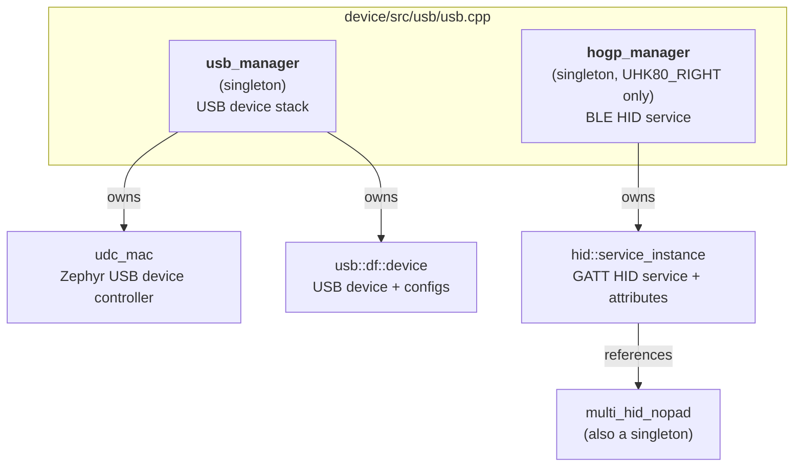
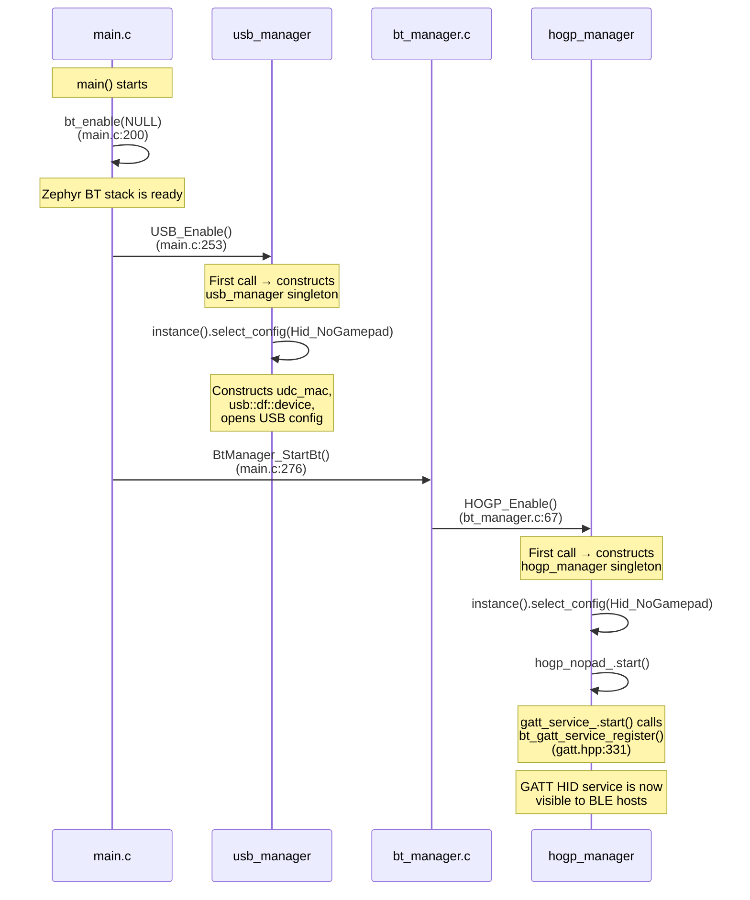
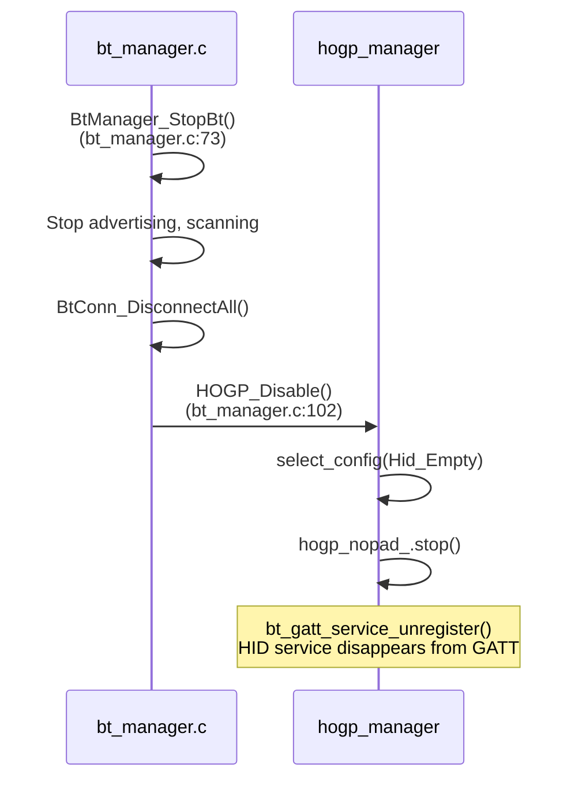
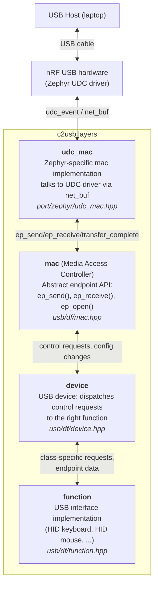
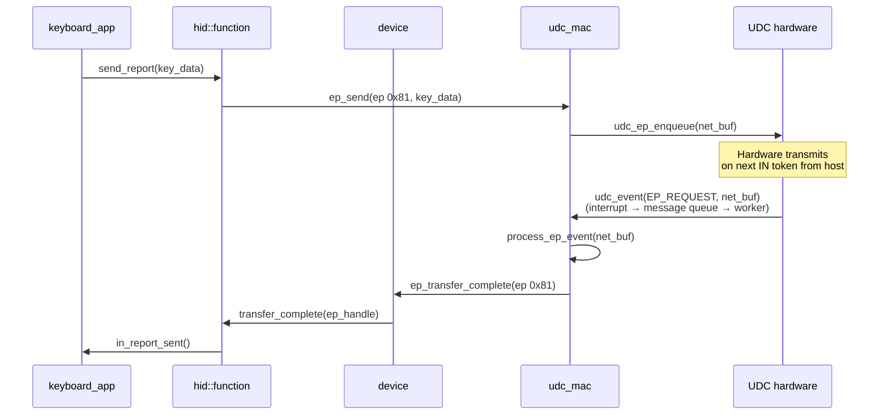
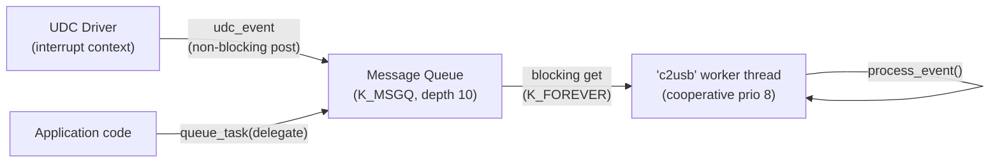

# c2usb Initialization and Firmware Integration

How c2usb gets constructed, initialized, and started on the UHK80 Right.

---

## Overview

There are two managers in `device/src/usb/usb.cpp`, both using the **static local singleton** pattern (`static T instance` inside `instance()`). They are **not** constructed at global init time — they're constructed on first call to `instance()`.



---

## Construction vs Activation

Nothing is registered with Zephyr at construction time. Construction only allocates storage and fills the attribute table in memory. **Registration happens later**, when `start()` is called:

| Phase | What happens | Zephyr API called |
|-------|-------------|-------------------|
| **Construction** | `service_instance` ctor → `service` ctor → `fill_attributes()` populates the GATT attribute array in memory | None |
| **`start()`** | `gatt_service_.start()` registers the attribute table with Zephyr's BT stack | `bt_gatt_service_register()` |
| **`stop()`** | `gatt_service_.stop()` unregisters it | `bt_gatt_service_unregister()` |

The `service` constructor (`hid.hpp:199-205`) calls `fill_attributes()` which writes all the characteristic/descriptor structs into the pre-allocated array. But nothing touches Zephyr yet.

---

## Boot Sequence



Key ordering constraints:
- `bt_enable()` must be called **before** HOGP registration (Zephyr BT stack must be up)
- `USB_SetSerialNumber()` must be called **before** `USB_Enable()` (see `main.c:253` comment)
- HOGP is only enabled on UHK80 Right (`DEVICE_IS_UHK80_RIGHT` guard)

---

## Shutdown / Disable



Note that disconnect happens **before** HOGP disable — any active HID connections are torn down first (triggering `BT_CONN_CB` → `stop_app()` → `app_.teardown()`), then the service is unregistered.

---

## The Singletons

### `usb_manager` (`usb.cpp:67-180`)

Constructed on first `instance()` call. Constructor (`usb.cpp:152-172`):
- Creates `udc_mac` from the Zephyr UDC device tree node
- Checks current USB power status (connected vs off)
- Sets up a power event delegate for suspend/wake tracking

`select_config()` (`usb.cpp:78-89`) queues the config change to run on the MAC's task queue (USB thread), not inline. The actual config switch happens in `change_config()` → `open_config()`, which creates static HID function objects and assembles USB configurations.

### `hogp_manager` (`usb.cpp:200-239`)

Constructed on first `instance()` call. Constructor is empty (`usb.cpp:229`) — the real work happens in member initialization:

```
hogp_nopad_{multi_hid_nopad::handle(), security, features}
```

This constructs a `service_instance<...>` which:
1. Allocates attribute and CCC arrays (sized at compile time from the report descriptor)
2. Calls `service` ctor → `fill_attributes()` to populate them
3. Does **not** call `bt_gatt_service_register()` yet

### `multi_hid_nopad` / `multi_hid` (`usb.cpp:46-65`)

Also a static local singleton (via `handle()`). Aggregates the individual HID app singletons (`keyboard_app::ble_handle()`, `mouse_app::ble_handle()`, etc.) into a single `hid::multi_application`.

---

## c2usb USB Layers

Before explaining `udc_mac`, here's how the USB side of c2usb is layered:



### `usb::df::device` — the dispatcher

`device` (`c2usb/usb/df/device.hpp:40-194`) is the central hub. It:

1. **Receives control requests** from the host (via `mac` → `on_control_setup()`)
2. **Handles standard USB requests** itself (GET_DESCRIPTOR, SET_ADDRESS, SET_CONFIGURATION)
3. **Routes class-specific requests** to the right `function` by interface number
4. **Manages configurations** — when the host sends SET_CONFIGURATION, `device` calls `enable()` on each function in that config, which opens their endpoints

It does **not** own the hardware. It talks to hardware exclusively through `mac`.

### `usb::df::function` — a USB interface

A `function` (`c2usb/usb/df/function.hpp:25-136`) is one USB interface — e.g., one HID device. Key virtual methods:

| Method | When called | What it does |
|--------|-------------|--------------|
| `describe_config()` | Building config descriptor | Adds interface/endpoint/HID descriptors |
| `enable()` | Host sends SET_CONFIGURATION | Opens endpoints, starts operation |
| `disable()` | Device reset or close | Closes endpoints |
| `control_setup_request()` | Class-specific SETUP arrives | Handles GET_REPORT, SET_IDLE, etc. |
| `transfer_complete()` | Endpoint transfer finishes | Processes sent/received data |

The firmware creates one `function` per HID interface (`usb.cpp:113-119`):

```
usb_kb       → keyboard HID function (endpoint 0x81)
usb_mouse    → mouse HID function    (endpoint 0x82)
usb_command  → command HID function  (endpoint 0x83)
usb_controls → controls HID function (endpoint 0x84)
usb_gamepad  → gamepad HID function  (endpoint 0x85)
```

### `usb::df::mac` — abstract hardware access

`mac` (`c2usb/usb/df/mac.hpp:25-137`) is the abstract interface that `device` and `function` use to talk to USB hardware. Key methods:

| Method                   | Direction  | Purpose                                                     |
| ------------------------ | ---------- | ----------------------------------------------------------- |
| `ep_open()`              | → hardware | Open an endpoint for transfers                              |
| `ep_send()`              | → hardware | Queue data to send to host on an IN endpoint                |
| `ep_receive()`           | → hardware | Queue a buffer to receive data from host on an OUT endpoint |
| `ep_close()`             | → hardware | Close an endpoint                                           |
| `ep_transfer_complete()` | ← hardware | Called when a transfer finishes (data sent or received)     |
| `bus_reset()`            | ← hardware | Called on USB bus reset                                     |
| `set_power_state()`      | ← hardware | Called on suspend/resume/VBUS events                        |

`mac` also owns the **control transfer buffer** and tracks the **active configuration**.

### How a USB keystroke flows

To make the layers concrete, here's what happens when the keyboard sends a key to the host over USB:



---

## `udc_mac` — Zephyr UDC Bridge

`udc_mac` is the concrete `mac` implementation for Zephyr. It bridges c2usb's abstract endpoint API to Zephyr's UDC (USB Device Controller) driver, which talks to the actual nRF USB hardware.

**Source:** `c2usb/port/zephyr/udc_mac.hpp`, `udc_mac.cpp`. Base class: `c2usb/usb/df/mac.hpp`.

### The worker thread

`udc_mac` owns a **dedicated worker thread** ("c2usb") and a **message queue** that serialize all USB work. The UDC driver fires events from interrupt context; the queue moves them to thread context:



The worker thread sits in an infinite loop (`udc_mac.cpp:144-151`):

```
while (true) {
    event = message_queue().get();   // blocks
    event_callback(event);           // dispatch
}
```

### What events arrive and what happens

| Event | Source | What `udc_mac` does |
|-------|--------|---------------------|
| `UDC_EVT_EP_REQUEST` | Hardware finished a transfer | Matches `net_buf` to endpoint, calls `ep_transfer_complete()` → flows up to `device` → `function` |
| `UDC_EVT_RESET` | Host reset the bus | Calls `bus_reset()`, sets address to 0, dequeues pending control data |
| `UDC_EVT_SUSPEND` | No bus activity for 3ms | `set_power_state(L2_SUSPEND)` → firmware calls `PowerMode_SetUsbAwake(false)` |
| `UDC_EVT_RESUME` | Bus activity resumes | `set_power_state(L0_ON)` → firmware calls `PowerMode_SetUsbAwake(true)` |
| `UDC_EVT_VBUS_READY` | USB cable plugged in | `set_power_state(L2_SUSPEND)`, `set_attached(true)` |
| `UDC_EVT_VBUS_REMOVED` | USB cable unplugged | `set_attached(false)`, `set_power_state(L3_OFF)` |
| `UDC_MAC_TASK` | Application code via `queue_task()` | Extracts delegate from event payload, calls it |

### `queue_task()` trick

`queue_task()` (`udc_mac.cpp:460-467`) packs an `etl::delegate<void()>` (a small callable — think lightweight `std::function`) directly into the bytes of a `udc_event.value` field via `memcpy`. The worker recognizes it by the special type `UDC_MAC_TASK` and calls it. This lets application code run arbitrary work on the USB thread without a separate mechanism.

### Thread creation

The thread is created via `SYS_INIT` at `POST_KERNEL` phase (`udc_mac.cpp:78-89`) — before `main()` runs. So by the time `usb_manager` is constructed, the worker thread is already waiting on the queue.

### Why this matters for HOGP

`udc_mac` is **USB-only** — HOGP doesn't use it. But it's important context because:
- `usb_manager::select_config()` queues work through `udc_mac::queue_task()`, which is why USB config changes are asynchronous
- The HID apps (`keyboard_app`, `mouse_app`, etc.) are shared between USB and BLE transports — understanding which thread context they run in matters

> [*Ask me for more*: endpoint buffer management (`net_buf` pool), power state transitions (L0-L3), how `usb_manager::select_config` uses atomic flags to coalesce rapid config changes, how HID apps provide separate `usb_handle()` vs `ble_handle()` instances]
