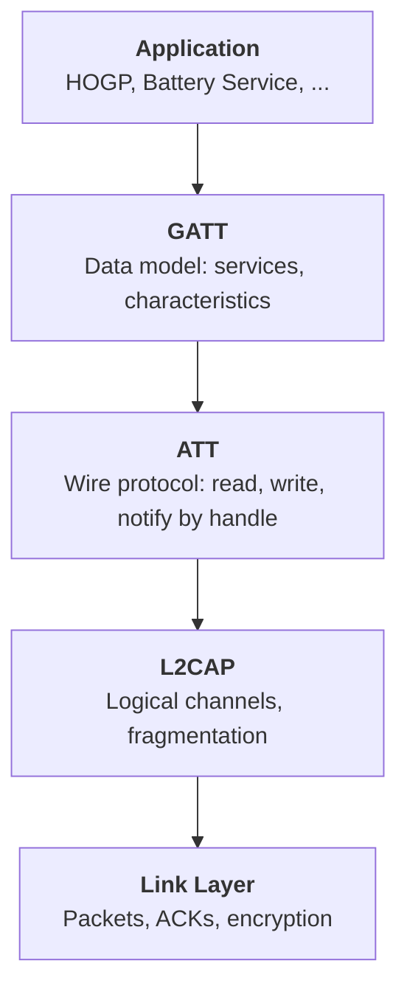
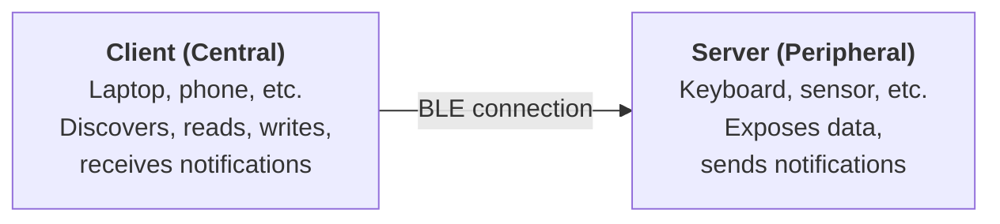
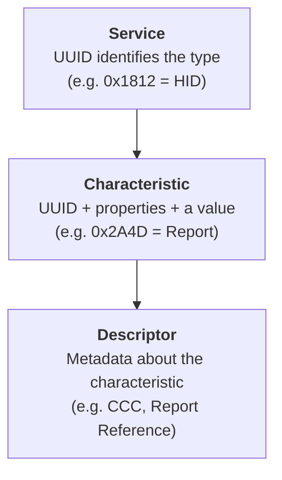
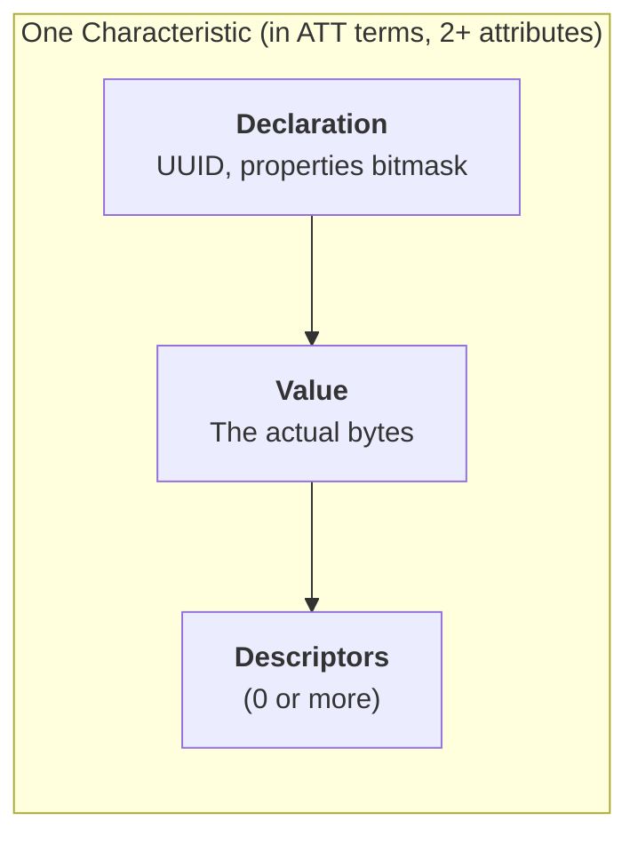
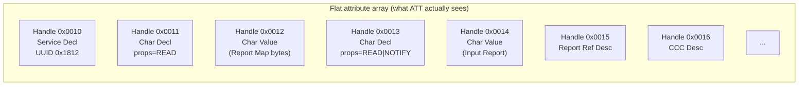
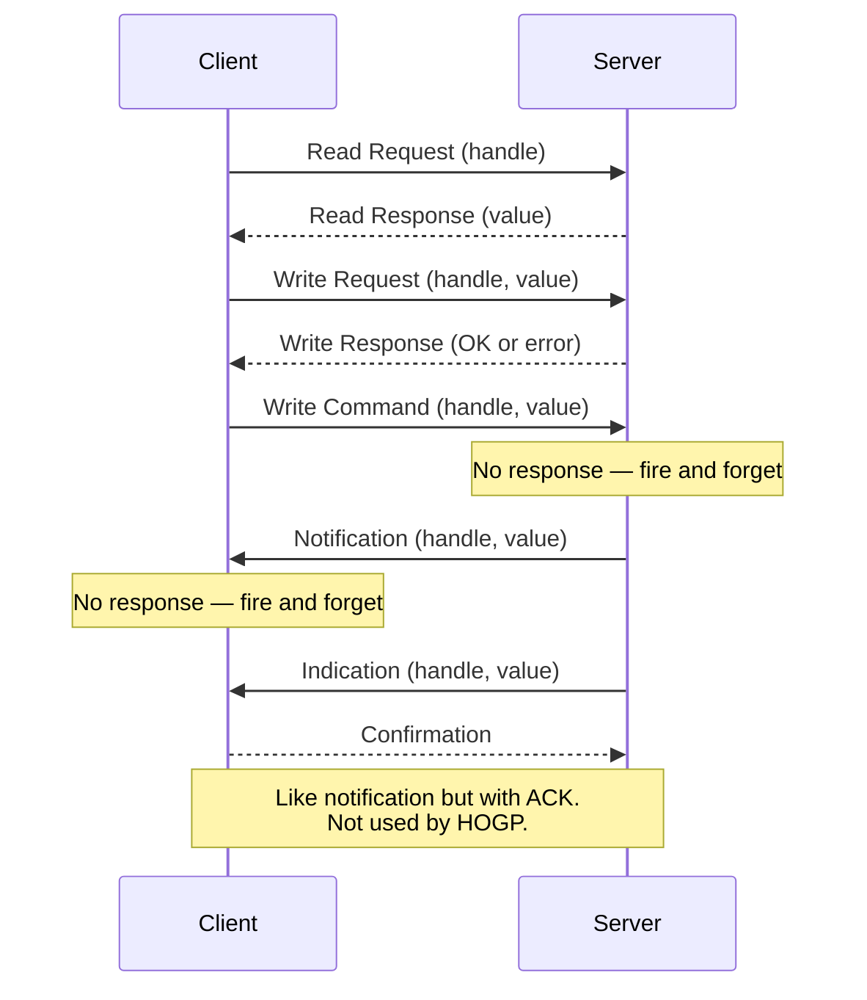
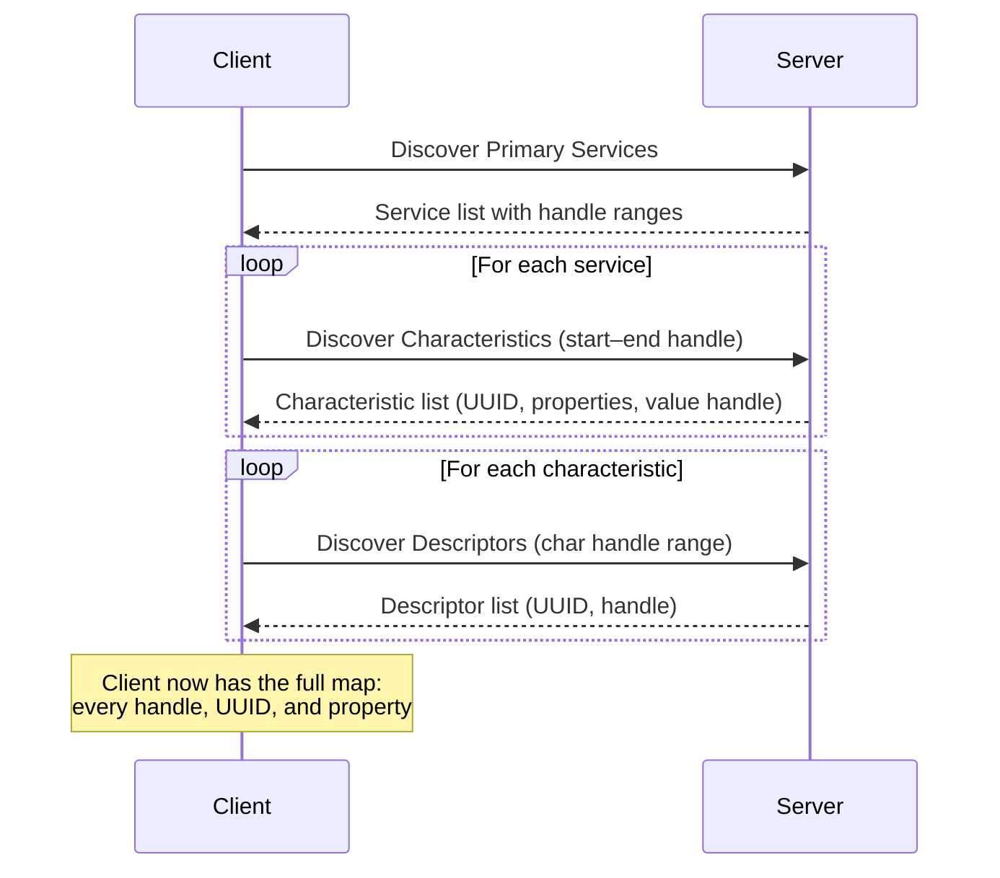
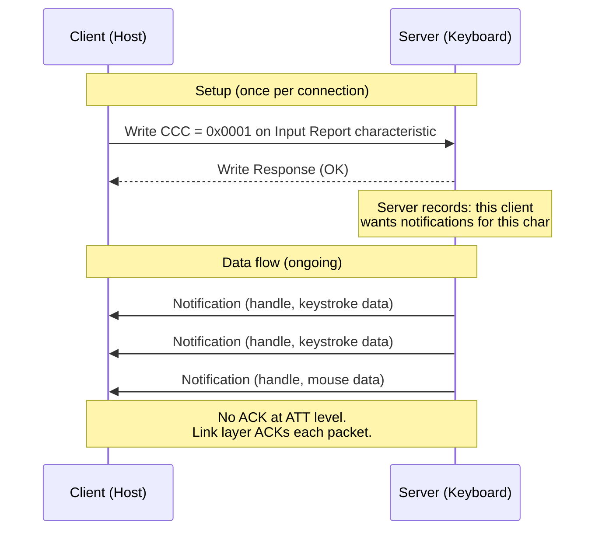

# GATT Primer

A quick reference for BLE's Generic Attribute Profile. Only covers what's relevant for understanding HOGP.

---

## BLE Protocol Stack (where GATT sits)

- **GATT** defines *what data exists* and *how it's organized* (services, characteristics, descriptors).
- **ATT** defines *how to access it* over the wire (read handle X, write handle Y, notify handle Z).
- Everything below ATT handles fragmentation, encryption, and radio — you don't interact with it.

---

## Roles

A device is a **server** if it holds data. A device is a **client** if it consumes data. These roles are fixed for a given service — a keyboard is always the server for HID.

---

## Data Model

GATT organizes a server's data into three nesting levels:

### Service

A logical grouping. Identified by a 16-bit UUID (SIG-defined) or 128-bit UUID (vendor). Examples:

| UUID   | Service        |
| ------ | -------------- |
| 0x1812 | HID over GATT  |
| 0x180F | Battery        |
| 0x1800 | Generic Access |

### Characteristic

A single piece of data inside a service. Has three parts:

The **properties** bitmask tells the client what operations are allowed:

| Property | Direction | Description |
|----------|-----------|-------------|
| READ | Client ← Server | Client can read the value |
| WRITE | Client → Server | Client can write, server ACKs |
| WRITE_WITHOUT_RESP | Client → Server | Client can write, no ACK |
| NOTIFY | Server → Client | Server can push updates (no ACK) |
| INDICATE | Server → Client | Server can push updates (with ACK) |

HOGP uses READ, WRITE, WRITE_WITHOUT_RESP, and NOTIFY. It does not use INDICATE.

**Concrete examples** (all from the HID service):

| Characteristic  | UUID   | Properties                 | Value contents                      | Why                                                               |
| --------------- | ------ | -------------------------- | ----------------------------------- | ----------------------------------------------------------------- |
| Report Map      | 0x2A4B | READ                       | HID report descriptor (binary blob) | Host reads once to learn the report format                        |
| Input Report    | 0x2A4D | READ, NOTIFY               | Last keystroke / mouse report       | Server notifies on each state change; host can also poll via READ |
| Output Report   | 0x2A4D | READ, WRITE, WRITE_NO_RESP | LED state (Caps Lock, etc.)         | Host writes to toggle keyboard LEDs                               |
| Protocol Mode   | 0x2A4E | READ, WRITE_NO_RESP        | 1 byte: 0=Boot, 1=Report            | Host can switch to boot mode for BIOS compatibility               |
| HID Information | 0x2A4A | READ                       | 4 bytes: bcdHID, country, flags     | Host reads once to check HID version                              |
| Control Point   | 0x2A4C | WRITE_NO_RESP              | 1 byte: 0=Suspend, 1=Exit Suspend   | Host tells device to enter/exit low power                         |

Note that Input Report and Output Report share the same UUID (`0x2A4D`). They're distinguished by their **Report Reference** descriptor (see below).

### Descriptor

Extra metadata attached to a characteristic. The two you'll see in HOGP:

- **CCC (Client Characteristic Configuration)** — UUID `0x2902`. The client writes a value here to control notifications:

  | CCC value | Meaning |
  |-----------|---------|
  | 0x0000 | Notifications off |
  | 0x0001 | Notifications on |
  | 0x0002 | Indications on |

- **Report Reference** — UUID `0x2908`. HOGP-specific. Contains 2 bytes: `[report_id, report_type]` so the client knows which HID report a characteristic carries.

---

## ATT: The Wire Protocol

Under the hood, GATT's services/characteristics/descriptors are stored as a flat array of **attributes**:

Each attribute has:

| Field | Size | Description |
|-------|------|-------------|
| Handle | 16-bit | Unique numeric ID, assigned by the stack |
| UUID | 16 or 128-bit | What kind of attribute (service decl, char value, CCC, etc.) |
| Permissions | flags | Who can read/write and under what security |
| Value | variable | The payload bytes |

### ATT Operations

All GATT reads/writes/notifications are carried as ATT PDUs (Protocol Data Units):

| Operation | Who initiates | ACK? | Typical HOGP use |
|-----------|---------------|------|------------------|
| Read Req/Resp | Client | Yes | Report Map, HID Info, current report |
| Write Req/Resp | Client | Yes | CCC subscription |
| Write Command | Client | No | Protocol Mode, Control Point, Output Reports |
| Notification | Server | No | Input Reports (keystrokes, mouse) |

### MTU

ATT has a maximum transmission unit (MTU) that limits how many bytes fit in one PDU. The default is **23 bytes** (20 bytes payload after the 3-byte ATT header). Client and server can negotiate a larger MTU after connecting. For HID reports this rarely matters — most reports are small.

> [*Ask me for more*: MTU negotiation procedure, long reads/writes for values exceeding MTU]

---

## Discovery

After connecting, the client doesn't know the server's attribute layout. It runs a discovery sequence:

**Bonded devices** (paired + keys stored) cache this layout. On reconnect they skip discovery and immediately start reading/subscribing by cached handle.

> [*Ask me for more*: what happens when the server changes its attribute table (GATT Service Changed indication), bonding vs pairing]

---

## Notifications: The Important Flow

This is the mechanism that delivers keystrokes. Here's the full setup + data flow:

The server can only send notifications for a characteristic **after** the client has enabled them by writing to that characteristic's CCC descriptor. Attempting to notify before that results in an error from the stack.

---

## Security

GATT attributes can require a certain security level before the client can access them:

| Level | Name | What it means |
|-------|------|---------------|
| 1 | No security | Open access |
| 2 | Encryption | Link must be encrypted (paired) |
| 3 | Authentication | Encrypted + MITM protection (e.g. passkey) |
| 4 | LE Secure Connections | Authenticated pairing with ECDH |

In the UHK's HOGP implementation, HID characteristics require **level 2 (encryption)** — the link must be paired/bonded before the host can read reports or subscribe to notifications.

> [*Ask me for more*: pairing vs bonding, LE Secure Connections, how Zephyr handles security elevation]
